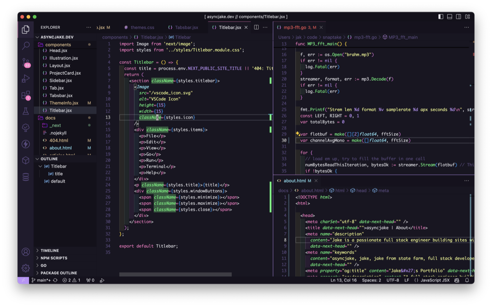

# colorjakd light and dark theme pack by [asyncjake](https://github.com/asyncjake)

If you just want to see the extension live in the marketplace, [check it out here!](https://marketplace.visualstudio.com/items?itemName=asyncjake.colorjakd)

This extension is a convenient combo pack my custom Violet Ice light themes with "forks" of awesome dark themes I like but wanted to tweak for some reason, bundled up simplify my extension list and theme lists. Plus a compulsion to add a bit more style to some already awesome themes. The themes I've forked are MIT license, with one fascinating exception, cheers to the mysterious lennythetechie. All sources cited below because humanity works better together 🙌

By "forks", I mean I found a theme I loved, lifted it by the power of the MIT license, and changed like two lines because I'm way too picky about this stuff. I followed the standard process to export a theme from VSCode, set up an extension, import the theme as code and adjust to taste, then republish it. **If you do this**, please respect the licenses of the extensions you're messing with. 

### Contributing
I'm picky about the existing themes so I'm unlikely to accept significant color updates, but if you have a theme to add or a really nice QoL change for an existing theme, I'm wide open to it! Just file an issue on [Github](https://github.com/asyncjake/colorjakd-vscode-themes/issues)

## Light Themes

### `colorjakd / violet ice [cool | white]`

Honestly, I just got sick of light themes having no soul and being really low contrast for no reason, so I made this from scratch. Now it's my daytime default ✨

Initial structure provided by `https://themes.vscode.one`, then upgraded over time as I 'dogfood' this one every day. Inspired by Arturia hardware and simple bright colors, this theme is primarily white and violet with a dash of teal and gold.

#### violet ice cool (teal accent)

#### violet ice white (simpler, cleaner)

#### violet ice menus

Kept them dark for a splash of contrast, but I don't see the menus often, so I'm open to making an all-light version upon request! Just file an issue on [Github](https://github.com/asyncjake/colorjakd-vscode-themes/issues) :)

## Dark Themes

### `colorjakd / andromeda` (forked from `EliverLara.andromeda`)

I probably haven't changed anything, I just love this theme

### `colorjakd / astronaut` (forked from `larabeatriz32.theme-astronaut`)

I probably haven't changed anything here either, this is excellent as-is

### `colorjakd / batman` (forked from `Vaporizer.vaporizer-dark`)

Updated scrollbars for better brooding 🦇

### `colorjakd / cyber` (forked from `Vaporizer.vaporizer-dark`)

Hacked proper scrollbars and comments and a couple other little details

### `colorjakd / hacker blue` (forked from `chausen.hacker-blue`)

Super clean with mysterious origins (see below). I've only changed the comment color from the original

### `colorjakd / synthwave` (forked from `RobbOwen.synthwave-vscode`)

Improved scrollbar and comment visibility - note that the original has a really cool glow effect made possible by sideloading some CSS into the VSCode startup process, but this version contains no such magic, it's just the colors

## License Info for All Themes

#### TLDR: This is all MIT except hacker-blue, which is unknown but shared in good faith that lennythetechie wanted these colors out in the world

All my custom `violet ice` themes are shared under the MIT license, and always will be! Feel free to fork or steal them yourself, the world is better in color 😄

`andromeda` was a successful heist from `EliverLara.andromeda` on the marketplace. There's [a public repository](https://github.com/EliverLara/Andromeda) released under the [MIT license](https://github.com/EliverLara/Andromeda/blob/master/LICENSE.md), thanks Eliver!

`astronaut` is lifted straight out of `larabeatriz32.astronaut`, which is also covered by the [MIT license](https://github.com/EliverLara/Andromeda/blob/master/LICENSE.md). Cheers Lara!

`batman` and `cyber` are stolen from the `Vaporizer.vaporizer-dark` theme pack on the VSCode marketplace. According to [the marketplace license link](https://marketplace.visualstudio.com/items/Vaporizer.vaporizer-dark/license), MIT License applies for these guys too. 

`hacker blue` is unique, it may be removed at any point, license information is unknown. The original theme was created by [lennythetechie on themes.vscode.one](https://themes.vscode.one/theme/lennythetechie/o8CSDFWb), but lenny doesn't seem to be on github. Lenny's theme was eventually found by a github user named chausen, but the theme wasn't published as an installable extension anywhere - so chausen pulled it into [their own github repo](https://github.com/chausen/hacker-blue) and published it. No license information is available in either location
- At the time of acquisition (and also writing this), themes.vscode.one's host (currently flamelab.io) has terms of service stating that users who upload/create content on their platform are responsible for enforcing their own copyright
- TLDR Lenny please reach out I want to give you credit, post an issue to this repo if you find it!
